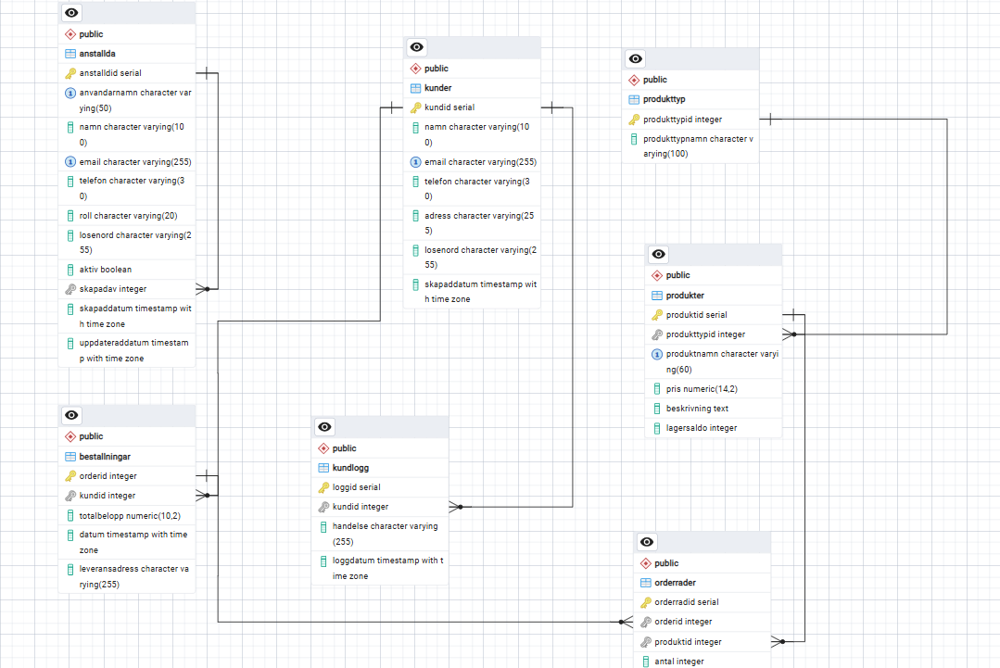

# Alex&Benjis Pizzeria
av Alexander Johansson och Benjamin Kullman YH25 VG Projekt

## Projektöversikt

Detta är ett slutprojekt i kursen Databaser där vi har byggt en pizzeria-applikation med Flask och PostgreSQL.
Systemet hanterar kunder,  personal, beställningar och produkter, och fokuserar extra mycket på dataintegritet,
säkerhet och tydliga roller mellan olika typer av användare.

Den senaste versionen av databasen innehåller tre tydliga användarflöden:

- `/` = för kunder som vill se menyn, registrera konto, logga in och lägga beställningar.
- `/anstallda` = för personal som bara får uppdatera pizzornas beskrivningar.
- `/admin`= för administratörer som får full tillgång till konton, sortiment och databassammanstallningar.

## Funktioner i projektet

### Publik kundsida

- Visa meny uppdelad på kategorier.
- Pizzor och övriga produkter har egna beskrivningar.
- Kunder kan registrera konto, logga in och uppdatera profil.
- Kunder kan skapa beställningar och få kvitto via vyn i databasen `OrdersammanFattning`.

### Personalflöde

- Flera personal- och adminkonton kan finnas samtidigt.
- Vanliga anställda loggar in via `/anstallda`.
- Vanliga anställda kan bara redigera `Beskrivning` pa pizzor.
- Syftet är att visa privilegier och ett begränsat arbetsflöde i appen.

### Adminflöde

- Admin loggar in via `/admin`.
- Admin kan skapa nya anställdakonton och fler admin-konton.
- Admin kan uppdatera användarnamn, namn, email, telefon, roll och aktiv-status.
- Admin kan resetta lösenord genom att skriva ett nytt lösenord på valfritt konto.
- Admin kan uppdatera full produktinformation: namn, pris, lager, produkttyp och beskrivning.
- Adminpanelen visar dessutom kunder, beställningar, orderrader, kundlogg och databassyn.

## Databasstruktur

Projektet bygger på en relationsdatabas i PostgreSQL med dessa huvudtabeller:

### `Kunder`

Lagrar kundkonton som kan registrera sig, logga in och beställa.

### `Produkttyp`

Används för att dela upp sortimentet i kategorier, till exempel `Pizza` och `Läsk & Sås`.

### `Produkter`

Lagrar alla produkter som säljs.
Den viktiga nya kolumnen är `Beskrivning`, vilket gör att varje pizza kan ha en egen text på menyn.

### `Bestallningar`

Lagrar en orderrad per bästallning och kopplar den till kund samt leveransadress.

### `Orderrader`

Lagrar vilka produkter som ingar i varje beställning och hur många av varje produkt som har beställts.

### `Kundlogg`

Används av triggers for att logga när kunder skapas eller uppdateras.

### `Anstallda`

Lagrar personal- och adminkonton.
Har finns användarnamn, kontaktuppgifter, roll, lösenordshash och aktiv-status.

## Databaskrav och VG-delar

### Trigger

Projektet innehåller flera triggers:

- `trigger_uppdatera_lager` minskar lagersaldo nar en ny orderrad skapas.
- `trigger_logga_ny_kund` loggar nya kundkonton.
- `trigger_kund_uppdatering` loggar nar en kundprofil uppdateras.
- Email formateras till små bokstäver via triggerfunktion.
- Personalens `UppdateradDatum` uppdateras automatiskt med en trigger.

### Stored procedure

`BeraknaTotalForsaljning(start_datum, slut_datum)` summerar försäljningen inom ett valfritt datumintervall.
Adminpanelen kan kalla proceduren direkt från webbgränssnittet.

### View

`OrdersammanFattning` bygger pa JOIN mellan `Bestallningar`, `Kunder`, `Orderrader` och `Produkter`.
Den anvands som kvittounderlag i appen och som tydligt exempel på hur en VIEW kan anvandas i projektet.

### Indexering

Följande har vi valt att indexera:

- `idx_bestallningar_kundid`
- `idx_bestallningar_datum`
- `idx_orderrader_orderid`
- `idx_produkter_typ`

## Säkerhetsstrategi

Projektet visar säkerhet på tre nivåer:

### 1. Roller i applikationen

- `admin`: full tillgång till konton, produkter och databaspanel.
- `anstalld`: begränsad tillgång till att uppdatera pizzornas beskrivningar.
- `kund`: kan bara hantera sitt eget konto och sina bestallningar.

### 2. Roller i databasen

I `inlamning.sql` finns rollerna:

- `pizzeria_admin` med full behörighet på tabellerna.
- `pizzeria_anstalld` med begränsad behörighet, mer specifikt `SELECT` på tabellerna och `UPDATE(Beskrivning)` på `Produkter`.
- `pizzeria_las` med läsbehörighet för rapportering till databasen.

Detta är viktigt för att visa hur privilegier kan styras både i appen och direkt i databasen.

### 3. Lösenordshashing med Scrypt

- Vi har valt använda oss av werkzeug.security biblioteket som innefattar saltning på hasharna, hashningsmetoden heter Scrypt.
- Att skydda lösenorden kopplade till alla konton är en högprioritet i en databas som sparar kunduppgifter.
- Vid varje nytt konto som skapas genom så hashas lösenordet i databasen då informationen skickas till python servern som i sin tur har en route till werkzeug biblioteket som lägger på hashning + saltning.

## Varför valde vi PostgreSQL som RDBMS?

Vi valde PostgreSQL eftersom projektet innehåller:

- tydliga relationer mellan flera tabeller
- behov av foreign keys, constraints och transaktioner
- behov av VIEW, stored procedure, trigger och roller
- behov av att kunna göra JOINs och sammanställningar på ett tydligt sätt

En relationsdatabas passar därför bättre än en NoSQL-lösning i detta scenario.

## Hur man kör projektet

1. Se till att PostgreSQL ar installerat och att databasen är tillgänglig.
2. Justera vid behov miljo-variablerna `DB_NAME`, `DB_USER`, `DB_PASSWORD`, `DB_HOST` och `DB_PORT`.
3. Starta appen med Python:

```bash
python app.py
```

4. Öppna sedan:

- `http://localhost:5001/`
- `http://localhost:5001/anstallda`
- `http://localhost:5001/admin`

## Reflektion & Analys

Det viktigaste designvalet i projektet är att separera kundkonton och personalroller i olika tabeller.
Det gör datamodellen tydligare och gör det enkelt att visa olika privilegier i presentationen.
Vad man hade kunnat implementera för en mer komplett webbapplikation är att ha en egen mailserver och en "Glömt lösenord?" funktion.
Avslutningsvis så finns det definitivt mer UX-designval man kan se över.

## ER-diagram.
Så här ser vårat ER-diagram ut till projektet:


